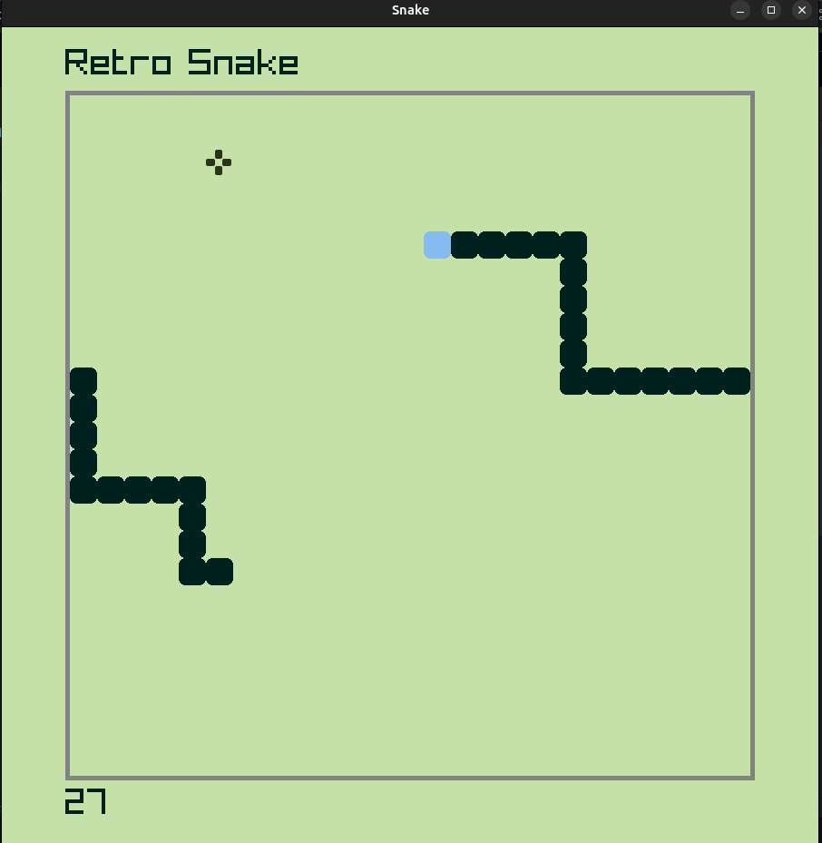

# sankeGame_cpp

## How to play?
### Linux
On linux you can run the SnakeGame file from the terminal located in the repository using ./SankeGame
### Windows
In windows you have to create the .exe executable file
